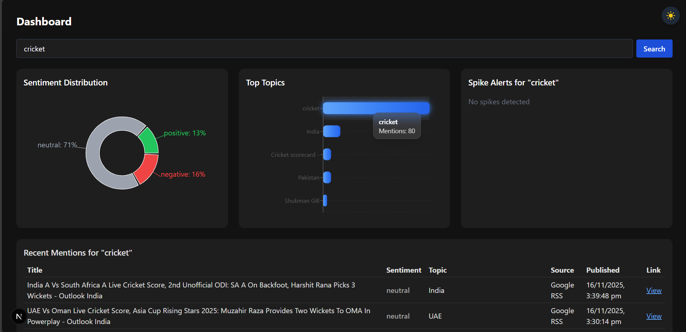

# Brand Tracker 🚀

[](https://nodejs.org/)
[](https://reactjs.org/)
[](https://www.mongodb.com/)
[](LICENSE)

**A Real-Time Brand Monitoring Dashboard with Spike & Sentiment Alerts**



Brand Tracker is a **full-stack MERN application** that automatically monitors brand mentions across multiple platforms (News, RSS, Reddit) and provides **real-time insights**, including **sentiment analysis** and **spike detection**.

---

## 📌 Table of Contents

1. [Tech Stack](#-tech-stack)  
2. [Features](#-features)  
3. [Project Structure](#-project-structure)  
4. [Getting Started](#-getting-started)  
5. [Cron Jobs](#-cron-jobs)  
6. [How It Works](#-how-it-works)  
7. [Hackathon Demo Highlights](#-hackathon-demo-highlights)  
8. [Future Improvements](#-future-improvements)  
9. [Author](#-author)

---

## 🏗️ Tech Stack

**Frontend:**  
* React 18 (Next.js for SSR)  
* Tailwind CSS  
* React-Slick Carousel for interactive home page  
* Mobile-first, responsive UI  

**Backend:**  
* Node.js & Express.js  
* MongoDB with Mongoose  
* REST API for mentions, stats, spike detection, negative trends, search  

**Services / Integrations:**  
* News API (`fetchMentions`)  
* RSS feeds (`fetchRSS`)  
* Reddit API (`fetchRedditMentions`)  
* Spike detection (`spikeDetector`)  
* Sentiment monitoring (`sentimentMonitor`)  

**Dev Tools:**  
* Git & GitHub  
* VS Code (PowerShell terminal)  
* Node Cron for scheduled data fetching  

---

## 🌟 Features

### Home Page
* Clean landing page with carousel & CTA buttons  
* Showcases brand visuals and navigation to Pre-book, About, Compare Products  

### Product Pages
* Pages for **SE03 Lite**, **SE03**, and **SE03 Max**  
* Detailed specifications, images, features  

### Comparison Page
* Side-by-side comparison of all products  
* Transparent modern layout  
* “Buy Now” button → redirects to Pre-book  

### Mentions & Alerts
* Real-time brand mentions from News, RSS, Reddit  
* **Spike detection:** sudden increase in mentions (Reddit-only)  
* Negative trend monitoring alerts  

### Search Functionality
* Fetches and merges mentions from all sources  
* Reddit mentions stored for spike detection  
* Sorted by published date  

### Cron Jobs
* Runs every 5 minutes  
* Updates mentions, spike alerts, negative trend alerts automatically  

---

## ⚙️ Project Structure

```

root/
├─ frontend/          # React / Next.js frontend
│  ├─ app/
│  ├─ components/
│  ├─ context/
│  ├─ package.json
│  └─ ...
├─ backend/           # Node.js / Express backend
│  ├─ src/
│  │  ├─ routes/
│  │  ├─ models/
│  │  ├─ services/
│  │  └─ index.js
│  ├─ package.json
│  └─ ...
├─ .gitignore
└─ README.md

````

---

## 🚀 Getting Started

### Prerequisites
* Node.js v18+  
* MongoDB (local or Atlas)  
* Git & GitHub  

### Installation

```bash
# Clone repo
git clone <your-github-url>
cd brand-tracker

# Frontend
cd frontend
npm install

# Backend
cd ../backend
npm install
````

### Environment Variables

Create `.env` in `backend/`:

```
PORT=5000
MONGO_URI=<your-mongodb-uri>
NEWS_API_KEY=<your-news-api-key>   # optional
```

### Run Application

```bash
# Backend
cd backend
npm run dev   # or node src/index.js

# Frontend
cd frontend
npm run dev
```

Open `http://localhost:3000` in browser.

---

## 📊 Cron Jobs

* Fetch mentions every 5 minutes:

  * News
  * RSS
  * Reddit
  * Spike alerts
  * Negative trend alerts

---

## 🧩 How It Works

1. **Data Fetching:** Services collect mentions from News, RSS, Reddit.
2. **Database:** MongoDB stores mentions with metadata (source, sentiment, date).
3. **Spike Detection:** Detect sudden mention spikes (Reddit-only).
4. **Sentiment Monitoring:** Identify negative trends.
5. **Frontend:** React dynamically displays mentions, stats, alerts.

---

## 🎯 Hackathon Demo Highlights

* Fully responsive, interactive home page carousel
* Real-time backend updates via cron jobs
* Spike alert container updates dynamically
* Search demonstrates multi-source fetching and merging

---

## 💡 Future Improvements

* YouTube mentions (paid API)
* User authentication & dashboard customization
* Enhanced UI charts for sentiment trends
* Export options for mentions & reports

---

## 👨‍💻 Author

**Yaman Khan** – Computer Engineering graduate

* GitHub: [https://github.com/Yamankhan23](https://github.com/Yamankhan23)
*  Email: yamankhan2000@gmail.com

---

